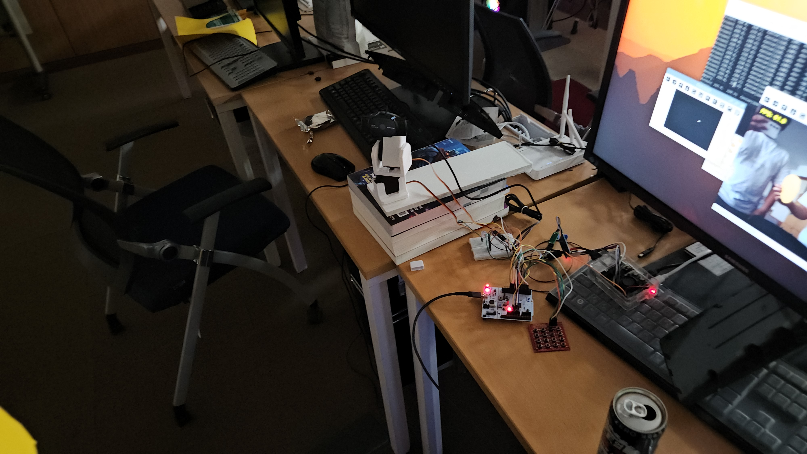
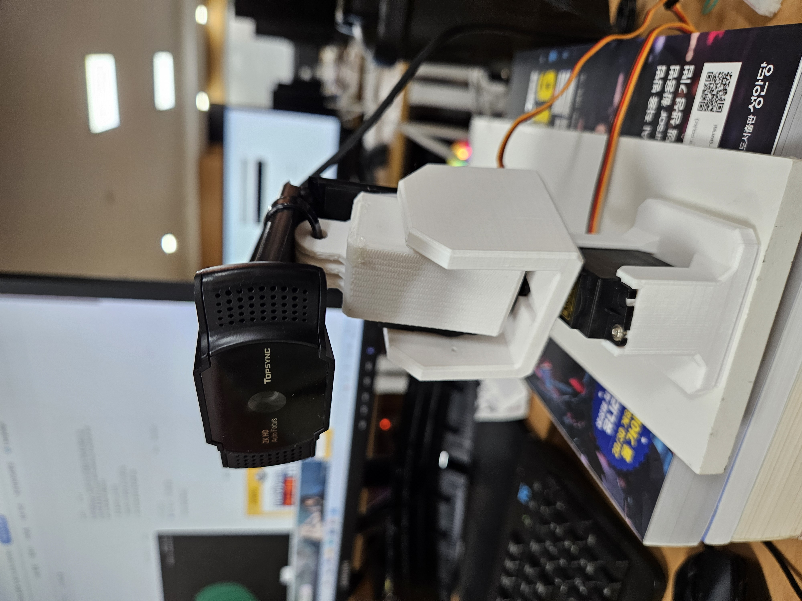
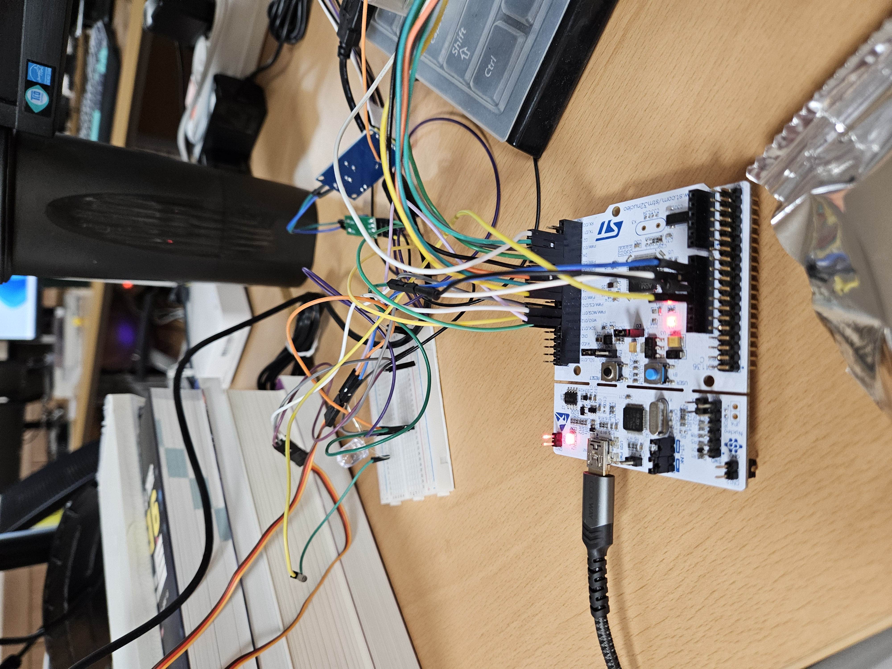
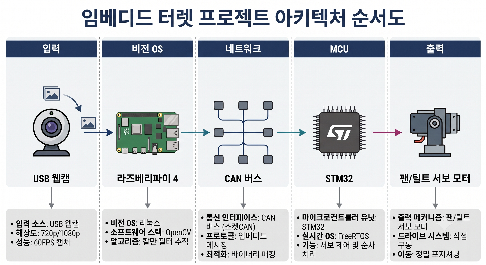
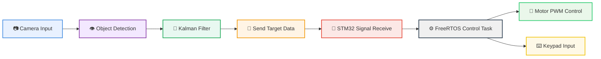

# Target Tracking System

카메라 기반 객체 추적과 STM32 제어를 결합한 실시간 자동 추적 시스템입니다.
Raspberry Pi에서 목표를 인식한 뒤, 추적 결과를 STM32로 전달해 모터와 서보 제어까지 이어지도록 구현한 터렛형 자동 추적 플랫폼입니다.

## 프로젝트 한눈에 보기

- 카메라 영상에서 목표 객체를 실시간으로 검출합니다.
- HSV 색상 기반 인식과 칼만 필터를 적용해 추적의 흔들림을 줄입니다.
- STM32의 CAN/UART 통신을 통해 제어 명령을 전달합니다.
- 수동 모드와 자동 추적 모드를 전환하며 실험할 수 있습니다.

## 실제 구현 모습

<div align="center">









</div>

## Project Overview

이 시스템은 다음 과정을 통해 동작합니다.

- 카메라 입력에서 목표 객체를 검출합니다.
- OpenCV를 활용해 객체의 중심 좌표를 추출합니다.
- 칼만 필터를 적용해 위치 추적의 안정성을 높입니다.
- 추적 결과를 STM32로 전송해 모터 제어를 수행합니다.
- 수동 모드와 자동 추적 모드를 전환할 수 있습니다.

## Key Features

- 실시간 객체 탐지 및 추적
- HSV 기반 색상 인식으로 목표를 빠르게 식별
- 칼만 필터를 이용한 위치 보정으로 흔들림 완화
- CAN/UART 통신을 통한 제어 신호 전달
- FreeRTOS 기반 멀티태스크 제어로 안정적인 동작 구현
- 수동/자동 모드 전환 기능으로 실험성과 확장성 확보

## System Architecture



### Hardware / Software Roles

- Raspberry Pi / Linux Environment
  - 카메라 입력 처리
  - 목표 탐지 및 좌표 계산
  - CAN 또는 UART를 통해 STM32로 제어 명령 전송

- STM32F4 / CubeMX Project
  - CAN 수신 및 메시지 파싱
  - FreeRTOS 태스크 기반 모터 제어
  - 키패드 입력을 통한 수동/자동 모드 전환

## Project Structure

```text
target_tracking_system/
├── README.md
├── Member_B.md
├── motor_project/
│   ├── motor_project.ioc
│   ├── Core/
│   │   ├── Inc/
│   │   └── Src/
│   │       ├── main.c
│   │       ├── freertos.c
│   │       ├── can.c
│   │       └── stm32f4xx_it.c
│   └── Drivers/
│       └── STM32F4xx_HAL_Driver/
├── ras/
│   ├── CMakeLists.txt
│   ├── face_detect.cpp
│   ├── face_detect2.cpp
│   └── face_detect
```

## Core Files

- [ras/CMakeLists.txt](ras/CMakeLists.txt)
  - Raspberry Pi용 OpenCV 빌드 환경을 구성합니다.

- [ras/face_detect.cpp](ras/face_detect.cpp)
  - 목표 객체를 탐지하고 칼만 필터로 추적한 뒤 CAN으로 STM32에 전송합니다.

- [ras/face_detect2.cpp](ras/face_detect2.cpp)
  - UART 기반 전송 방식을 실험하기 위한 대체 구현입니다.

- [motor_project/Core/Src/main.c](motor_project/Core/Src/main.c)
  - STM32의 초기화, CAN 설정, 수신 처리의 진입점입니다.

- [motor_project/Core/Src/freertos.c](motor_project/Core/Src/freertos.c)
  - FreeRTOS 기반 모터 제어 태스크와 키패드 입력 처리 로직을 포함합니다.

- [motor_project/motor_project.ioc](motor_project/motor_project.ioc)
  - CubeMX 설정 파일로, 펌웨어 구성을 재생성할 때 사용됩니다.

## Workflow

1. 카메라로 프레임을 읽습니다.
2. 노란색 객체를 HSV 색공간에서 검출합니다.
3. 윤곽선 기반으로 중심 좌표를 계산합니다.
4. 칼만 필터로 추적 결과를 안정화합니다.
5. 좌표 오차를 STM32로 전송합니다.
6. STM32는 수신값을 바탕으로 서보/모터 PWM 값을 갱신합니다.
7. 키패드를 통해 수동 조작 또는 자동 추적 모드를 전환할 수 있습니다.

## Build & Run

### Raspberry Pi / Linux

Required Packages

- OpenCV
- CMake
- C++17 compatible compiler

Example Build

```bash
cd ras
cmake -S . -B build
cmake --build build
```

실행

```bash
./build/face_detect
```


### STM32 펌웨어

1. STM32CubeIDE 또는 STM32CubeMX를 실행합니다.
2. [motor_project/motor_project.ioc](motor_project/motor_project.ioc) 를 열어 프로젝트를 다시 생성합니다.
3. 빌드 후 보드에 플래시합니다.

## Technical Highlights

- HSV 기반 색상 검출
- 칼만 필터를 통한 목표 위치 안정화
- CAN/UART 기반 통신 구현
- FreeRTOS를 활용한 멀티태스크 제어
- 수동 모드와 자동 추적 모드 전환

## Project Results

이번 프로젝트를 통해 다음과 같은 결과를 도출했습니다.

- 카메라 입력 기반 목표 객체를 실시간으로 추적하는 흐름을 완성했습니다.
- OpenCV와 STM32 간 통신을 연결해, 인식 결과가 실제 모터 제어로 이어지도록 구성했습니다.
- 칼만 필터를 적용해 추적의 흔들림을 줄이고 안정적인 제어에 기여했습니다.
- FreeRTOS 기반 태스크 구조를 적용해 제어 로직과 입력 처리의 책임을 분리했습니다.
- 수동 제어와 자동 추적 모드를 함께 지원해, 시스템의 확장성과 실험성을 높였습니다.

## Future Improvements

- 실시간 시각화 화면 추가로 추적 과정을 더 직관적으로 확인
- 더 다양한 객체/색상 검출 기능 확장
- PID 제어 고도화로 반응 속도와 정밀도 개선
- 로봇/포탑 제어와 연동해 실제 응용 가능성 확대
- 데이터 로깅 및 추적 성능 분석을 통한 최적화
